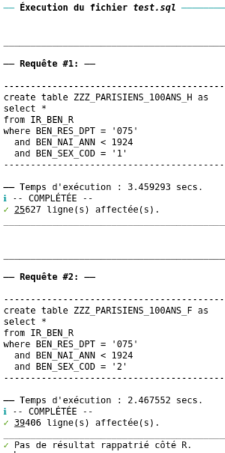
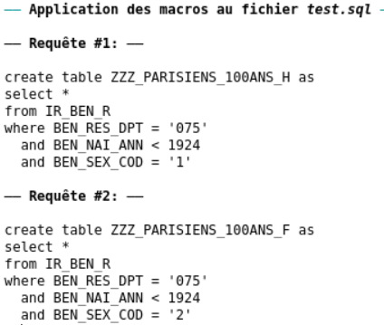

# sndsmart

+ Ce package facilite l'accès et le requêtage des données ORACLE sur le SNDS

## Installation
+ Il faut d'abord installer le package suivant https://github.com/pietrodito/sndshare

## Connexion
```
sndsmart::connect()
```

## Éxecution de requêtes SQL
+ Préparez un fichier `test.sql`
+ Chaque requête devra être séparée d'une autre par la ligne suivante :
    ```
    /
    ```
+ Exemple de fichier :
    ```{sql}
    create table ZZZ_PARISIENS_100ANS_H as
    select *
    from IR_BEN_R
    where BEN_RES_DPT = '075'
      and BEN_NAI_ANN < 1924
      and BEN_SEX_COD = '1'
    /

    create table ZZZ_PARISIENS_100ANS_F as
    select *
    from IR_BEN_R
    where BEN_RES_DPT = '075'
      and BEN_NAI_ANN < 1924
      and BEN_SEX_COD = '2'
    /
    ```
    + On exécute ce fichier :
        ```
        sndsmart::exec_sql_file("test.sql")
        ```

    + On obtient ceci :

    <p align="center">
          
    </p>

## Gestion des tables ORAUSER
+ Lister les tables
    ```
    sndsmart::list_tables()
    ```
+ Supprimer des tables
    ```
    sndsmart::drop_table(prefixe = "ZZZ_")
    ```
## Utilisation de macros `m4`
+ Vous pouvez utiliser des [macros m4](https://www.gnu.org/software/m4/manual/m4.html) dans vos scripts SQL
+ Sachez que les [délimiteurs sont déjà redéfinis](https://www.gnu.org/software/m4/manual/html_node/Changequote.html).

### Définir une macro :
```
define([REMPLACE_MOI], [PAR_CECI])
```
+ Toutes les occurences de `REMPLACE_MOI` seront substituées par `PAR_CECI` avant envoi au serveur SQL.

### Exemples de macros simples :
+ Si on reprend le code sql précédent :
    ```
    define([PARISIENS], [BEN_RES_DPT = '075'])
    define([CENTENAIRES], [BEN_NAI_ANN < 1924])
    define([HOMME], [BEN_SEX_COD = '1'])
    define([FEMME], [BEN_SEX_COD = '2'])

    create table ZZZ_PARISIENS_100ANS_H as
    select *
    from IR_BEN_R
    where PARISIENS
      and CENTENAIRES
      and HOMME
    /

    create table ZZZ_PARISIENS_100ANS_F as
    select *
    from IR_BEN_R
    where PARISIENS
      and CENTENAIRES
      and FEMME
    /
    ```

+ Vous pouvez voir le résultat de l'application des macros sans exécuter :
    ```
    sndsmart::show_sql_after_macro("test.sql")
    ```

    <p align="center">
          
    </p>

### Exemple de macros imbriquées : 

```
define([PARISIENS], [BEN_RES_DPT = '075'])
define([CENTENAIRES], [BEN_NAI_ANN < 1924])
define([HOMME], [BEN_SEX_COD = '1'])
define([FEMME], [BEN_SEX_COD = '2'])

define([PARISIENS_100ANS], [
select *
from IR_BEN_R
where PARISIENS
  and CENTENAIRES
  
])

create table ZZZ_PARISIENS_100ANS_H as
PARISIENS_100ANS
  and HOMME
/

create table ZZZ_PARISIENS_100ANS_F as
PARISIENS_100ANS
  and FEMME
/
```

### Marcros à votre disposition
+ Des macros vous sont proposées dans le répertoire [inst/extdata/macros](inst/extdata/macros)
