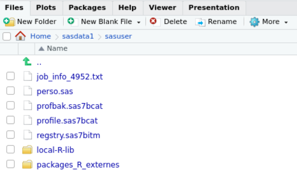
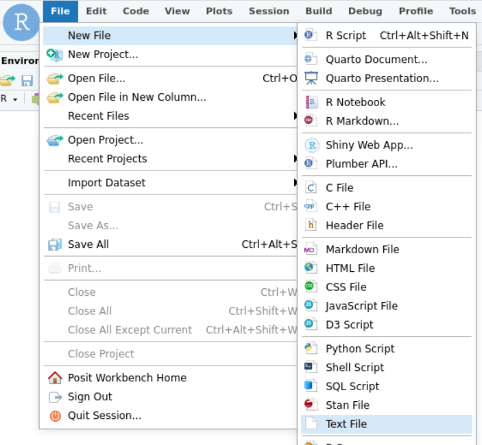
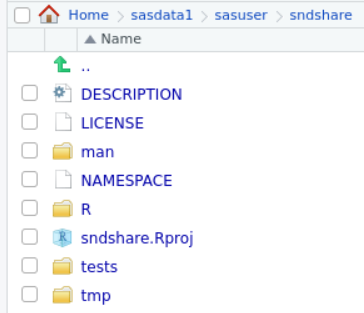
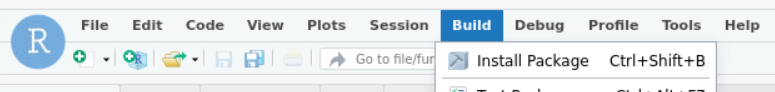

# sndsmart

+ Ce package facilite l'accès et le requêtage des données ORACLE sur le SNDS

## Installation Rapide
+ Exécutez le code suivant sur la console :
+ /!\ Attention ce code modifie votre fichier `.Rprofile`
+ Si vous n'avez jamais modifé ce fichier tout devrait bien se passer, sinon lisez l'installation détaillée plus bas. 
```
unlink(paste0("~/sasdata1/sasuser/", c("packages_R_externes", "local-R-lib"), "/sndsmart/"), force = T, recursive = T)
fs::dir_create(paste0("~/sasdata1/sasuser/", c("packages_R_externes/", "local-R-lib/")))
system("
  if grep -Fxq "local-R-lib" ~/.Rprofile
  then
  else
    echo '.libPaths(c(\"~/sasdata1/sasuser/local-R-lib/\", .libPaths()))' >> ~/.Rprofile
  fi
")
file.edit("~/sasdata1/sasuser/packages_R_externes/sndsmart.csv")
```
+ Copiez/collez dedans le contenu du fichier [`zzz_sndsmart.csv`](https://raw.githubusercontent.com/pietrodito/sndsmart/main/zzz_sndsmart.csv).
+ Puis sauvegardez.

+ Exécutez le code suivant sur la console :
```
system("base64 -d ~/sasdata1/sasuser/packages_R_externes/sndsmart.csv > sndsmart.zip")
system("unzip -o sndsmart.zip -d ~/sasdata1/sasuser/packages_R_externes/")
system("rm sndsmart.zip ~/sasdata1/sasuser/packages_R_externes/sndsmart.csv")
rstudioapi::openProject("~/sasdata1/sasuser/packages_R_externes/sndsmart/sndsmart.Rproj")
```

+ Cliquez sur `Install Package` dans le menu `Build`

## Connexion
```
sndsmart::connect()
```

## Éxecution de requêtes SQL
+ Préparez un fichier `test.sql`
+ Chaque requête devra être séparée d'une autre par la ligne suivante :
    ```
    /
    ```
+ Exemple de fichier :
    ```{sql}
    create table ZZZ_PARISIENS_100ANS_H as
    select *
    from IR_BEN_R
    where BEN_RES_DPT = '075'
      and BEN_NAI_ANN < 1924
      and BEN_SEX_COD = '1'
    /

    create table ZZZ_PARISIENS_100ANS_F as
    select *
    from IR_BEN_R
    where BEN_RES_DPT = '075'
      and BEN_NAI_ANN < 1924
      and BEN_SEX_COD = '2'
    /
    ```
    + On exécute ce fichier :
        ```
        sndsmart::exec_sql_file("test.sql")
        ```

    + On obtient ceci :

    <p align="center">
          
    </p>

## Gestion des tables ORAUSER
+ Lister les tables
    ```
    sndsmart::list_tables()
    ```
+ Supprimer des tables
    ```
    sndsmart::drop_table(prefixe = "ZZZ_")
    ```
## Utilisation de macros `m4`
+ Vous pouvez utiliser des [macros m4](https://www.gnu.org/software/m4/manual/m4.html) dans vos scripts SQL
+ Sachez que les [délimiteurs sont déjà redéfinis](https://www.gnu.org/software/m4/manual/html_node/Changequote.html).

### Définir une macro :
```
define([REMPLACE_MOI], [PAR_CECI])
```
+ Toutes les occurences de `REMPLACE_MOI` seront substituées par `PAR_CECI` avant envoi au serveur SQL.

### Exemples de macros simples :
+ Si on reprend le code sql précédent :
    ```
    define([PARISIENS], [BEN_RES_DPT = '075'])
    define([CENTENAIRES], [BEN_NAI_ANN < 1924])
    define([HOMME], [BEN_SEX_COD = '1'])
    define([FEMME], [BEN_SEX_COD = '2'])

    create table ZZZ_PARISIENS_100ANS_H as
    select *
    from IR_BEN_R
    where PARISIENS
      and CENTENAIRES
      and HOMME
    /

    create table ZZZ_PARISIENS_100ANS_F as
    select *
    from IR_BEN_R
    where PARISIENS
      and CENTENAIRES
      and FEMME
    /
    ```

+ Vous pouvez voir le résultat de l'application des macros sans exécuter :
    ```
    sndsmart::show_sql_after_macro("test.sql")
    ```

    <p align="center">
          
    </p>

### Exemple de macros imbriquées : 

```
define([PARISIENS], [BEN_RES_DPT = '075'])
define([CENTENAIRES], [BEN_NAI_ANN < 1924])
define([HOMME], [BEN_SEX_COD = '1'])
define([FEMME], [BEN_SEX_COD = '2'])

define([PARISIENS_100ANS], [
select *
from IR_BEN_R
where PARISIENS
  and CENTENAIRES
  
])

create table ZZZ_PARISIENS_100ANS_H as
PARISIENS_100ANS
  and HOMME
/

create table ZZZ_PARISIENS_100ANS_F as
PARISIENS_100ANS
  and FEMME
/
```

### Marcros à votre disposition
+ Des macros vous sont proposées dans le répertoire [inst/extdata/macros](inst/extdata/macros)
+ Elles sont immédiatement disposibles dans vos scripts SQL.


# Comment exporter/importer un projet ?

+ Permet de partager simplement des projets SNDS menés sous RStudio.
+ Permet également de partager des packages R créés sur la plateforme.

## Export d'un projet
+ Un projet/répertoire est compressé au format ZIP, puis encodé en [base64](https://fr.wikipedia.org/wiki/Base64) dans un fichier CSV à une seule colonne large de 76 caractères.
+ Ce fichier est ensuite placé dans votre répertoire download sur la plateforme
+ Si votre export concerne un package il est préférable que sa commande de BUILD l'installe dans le répertoire `~/sasdata1/sasuser/local-R-lib`

## Import d'un projet
+ Pour un projet normal, il suffit de copier/coller, dans un fichier format texte, le contenu du fichier CSV exporté avec la méthode ci-dessus.
+ Pour un projet volumineux, on peut importer le CSV vers la librairie ORAUSER depuis SAS pour en faire une table ORACLE.
+ Enfin on appelle la fonction d'import du package.


# Installation détaillée

## Deux outils linux bash pour faciliter la manipulation des fichiers encodés en base64
+ Dans le répertoire linux_utils de ce dépot
### `extract_files_from_csv`
+ Décode et décompresse immédiatement le fichier `.csv`
### `update_csv_from_local`
+ Si vous modifiez votre projet sur votre machine locale, cette commande met à jour le fichier encodé `.csv` pour tenir compte de ces modifications.
+ /!\ Attention ce second batch est dépendant du premier qui doit être dans le `$PATH`


## Paramètrage de R et RStudio

### Création des répertoires nécessaires
+ Un répertoire pour le code source de ce package et de vos futurs packages :
```
Home/sasdata1/sasuser/packages_R_externes/
```
+ Un répertoire pour la version compilée des packages :
```
`Home/sasdata1/sasuser/local-R-lib/`
```
    
+ Vous pouvez executer les lignes suivantes sur la console pour la création des répertoires :
```
fs::dir_create(paste0("~/sasdata1/sasuser/", c("packages_R_externes/", "local-R-lib/")))
```
+ Vous devriez pouvoir obtenier le résultat suivant :

    <p align="center">
      
    </p>


### Désigner le répertoire `local-R-lib` comme un répertoire de librairies
+ Il faut créer un fichier texte `.Rprofile` dans votre répertoire `home` avec le contenu suivant :
+ Ou bien ajouter cette ligne si vous avez déjà un fichier `.Rprofile`
+ Ou juste ajouter le répertoire `~/sasdata1/sasuser/local-R-lib/`, si vous avez déjà modifié `.libPaths`

```
.libPaths(c("~/sasdata1/sasuser/local-R-lib/", .libPaths()) 
```

+ La commande suivante exécutée sur la console crée le fichier avec le bon contenu :
```
system("echo '.libPaths(c(\"~/sasdata1/sasuser/local-R-lib/\", .libPaths()))' > ~/.Rprofile")
```

+ Vous devriez pouvoir obtenier le résultat suivant :

    <p align="center">
      
    </p>

+ Vous pouvez alors vérifier le contenu de `.Rprofile`

### Copier le contenu du package `sdnsmart` vers le serveur RStudio

+ Il faut copier/coller le contenu du fichier `zzz_sndsmart.csv` de ce dépot git.
+ Il faut d'abord créer un nouveau fichier `.txt` côté RStudio (le type du fichier est TRÈS IMPORTANT):
    <p align="center">
      
    </p>
+ Il faut copier/coller le contenu du fichier `zzz_sndsmart.csv` le fichier RStudio ouvert
+ NB : vous trouverez le fichier `zzz_sndsmart.csv` dans la liste des fichiers de ce dépot tout en haut de cette page)

+ Une fois copié/collé le contenu, sauvegardez le fichier dans le répertoire `home/sasdata1/sasuser` en le nommant `sndsmart.csv`.
+ Vous devriez obtenir le résultat suivant :
    <p align="center">
      
    </p>

### Production du répertoire du code source du package à partir du fichier `.csv`
+ Il faut utiliser `base64` et `unzip` comme ceci :
```
system("base64 -d ~/sasdata1/sasuser/packages_R_externes/sndsmart.csv > sndsmart.zip")
system("unzip -o sndsmart.zip -d ~/sasdata1/sasuser/packages_R_externes/")
system("rm sndsmart.zip ~/sasdata1/sasuser/packages_R_externes/sndsmart.csv")
```
+ Vous devriez pouvoir obtenir le résultat suivant :
    <p align="center">
      
    </p>

+ Cliquez sur le fichier `sndsmart.Rproj` pour ouvrir le projet du package.

### Construction du package sur le serveur

+ Bravo vous avez réussi à copier votre premier package sur la plateforme.
+ Le package `sndsmart` que vous êtes en train d'installer va automatiser tout ce processus.
+ Il ne vous reste plus qu'à l'installer en cliquant sur le menu `Build` puis `Install Package` :

    <p align="center">
      
    </p>


+ Voilà c'est terminé !

### Vérification

+ Tapez `library(sndsmart)` dans la console, si vous n'obtenez pas de message d'erreur c'est que l'installation est réussie.
